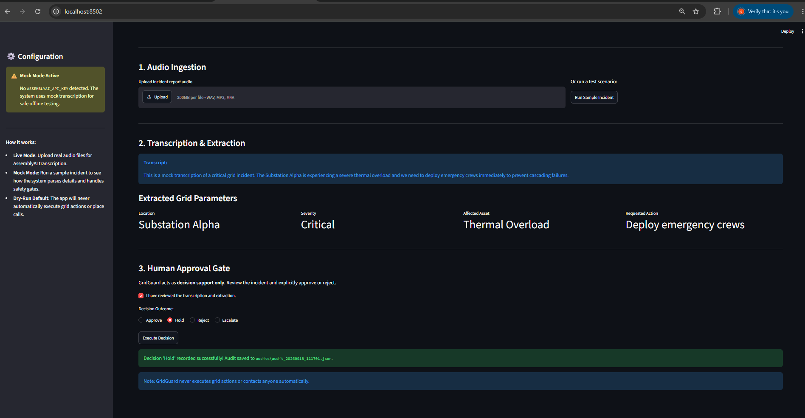
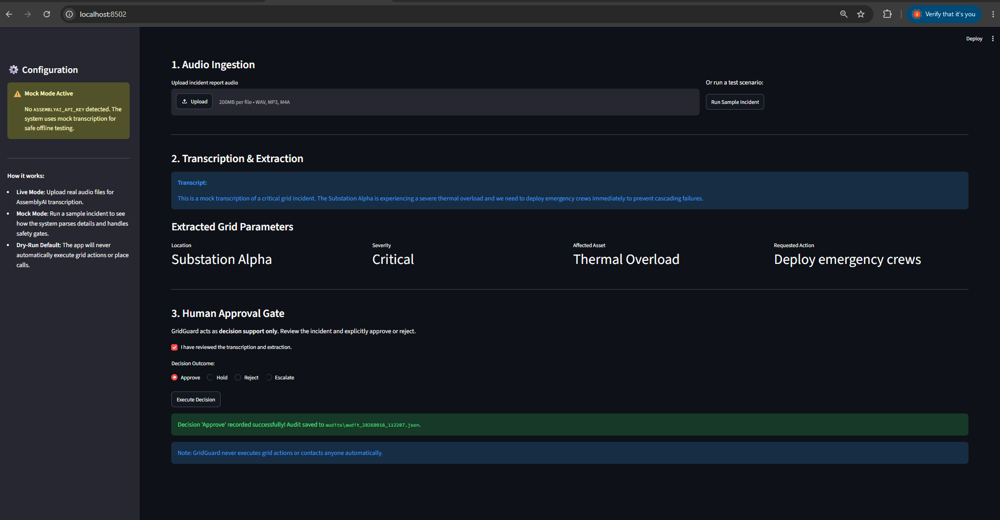
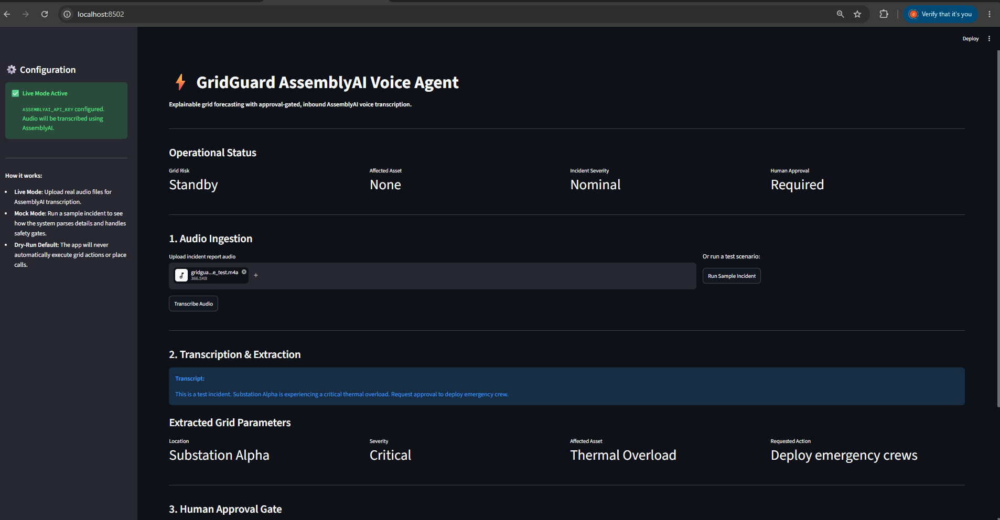
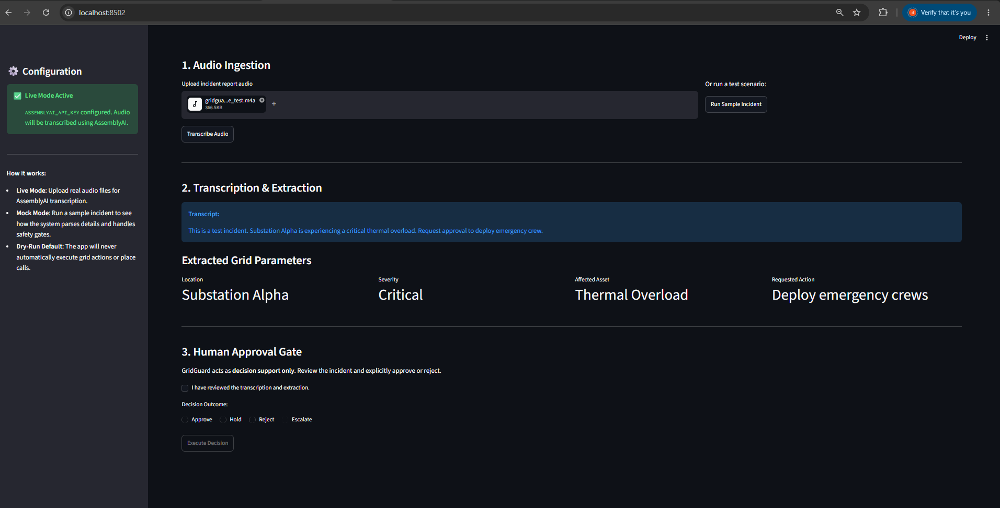
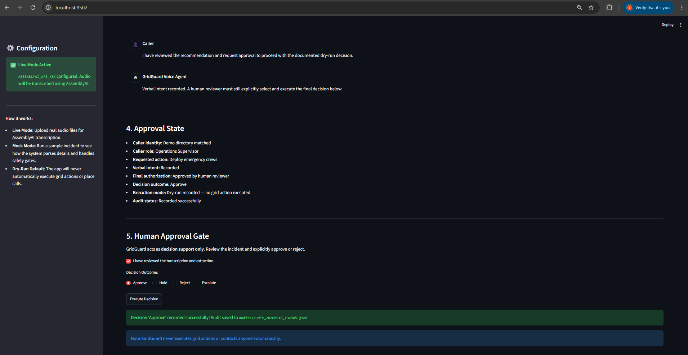

# GridGuard AssemblyAI Voice Agent

Explainable grid forecasting with approval-gated, inbound AssemblyAI voice transcription. This project is a separate edition of the original GridGuard Voice Escalation Agent, replacing the Call-E outbound calling with inbound AssemblyAI-powered audio transcription.

## Features
- **Upload Incident Audio**: Accepts `.wav`, `.mp3`, and `.m4a` files.
- **AssemblyAI Transcription**: Uses the official AssemblyAI Python SDK to transcribe audio incidents.
- **Mock Mode**: Fully functional offline mock mode when `ASSEMBLYAI_API_KEY` is not provided.
- **Entity Extraction**: Extracts incident location, severity, affected asset, and requested action.
- **Voice Conversation Workflow**: Demonstrates a credible operational timeline where AssemblyAI provides the initial transcription, a deterministic demo authorization service verifies the caller's role (note: this is a mock directory lookup, not biometric or voice authentication), and an explicit on-screen human approval gate must be cleared before any action is recorded.
- **Human-in-the-loop Governance**: Strict approval gate requiring human consent before decisions are executed.
- **Audit Logging**: JSON-based audit packet logging.

## Windows Setup Instructions

### 1. Requirements
Ensure you have Python 3.8+ installed.

### 2. Virtual Environment Setup
It is recommended to use a virtual environment.
```powershell
# Create virtual environment
python -m venv venv

# Activate virtual environment
.\venv\Scripts\activate
```

### 3. Install Dependencies
```powershell
pip install -r requirements.txt
```

### 4. Configuration
Create a `.env` file based on `.env.example`:
```powershell
copy .env.example .env
```
If you want to test live transcription, add your AssemblyAI API key to `.env`:
```
ASSEMBLYAI_API_KEY=your_actual_key_here
```
If you leave it blank, the app runs in **Mock Mode**, allowing you to test the workflow safely.

### 5. Running Tests
To verify the extraction logic and audit gates:
```powershell
pytest tests/
```

### 6. Run the Application
Launch the Streamlit interface:
```powershell
streamlit run app.py
```
The application will open in your default browser at `http://localhost:8501`.

## Demo Walkthrough

GridGuard supports both:
* **Live Mode**: AssemblyAI transcribes uploaded audio.
* **Mock Mode**: deterministic offline fallback for safe testing.
* **Dry-run by default**: all proposed actions require explicit human approval and are audit logged; no real grid action is executed.

1. **Mock-mode hold decision:** demonstrates the safe offline fallback and an auditable "Hold" outcome.


2. **Mock-mode approved decision:** demonstrates a reviewed mock incident being approved and recorded in the audit trail.


3. **Live AssemblyAI transcription and extraction:** demonstrates a real uploaded audio file transcribed through AssemblyAI, with location, severity, affected asset, and requested action extracted.


4. **Human approval required:** demonstrates that a critical live incident cannot proceed until a human explicitly confirms review and selects a decision.


5. **Approved dry-run audit trail:** demonstrates an approved live workflow being recorded to the audit trail while GridGuard remains decision support only and never executes grid actions or contacts people automatically.

