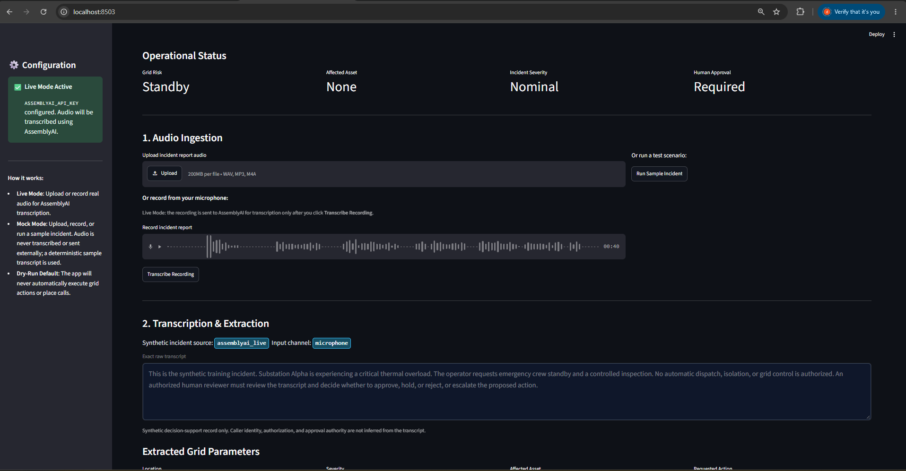
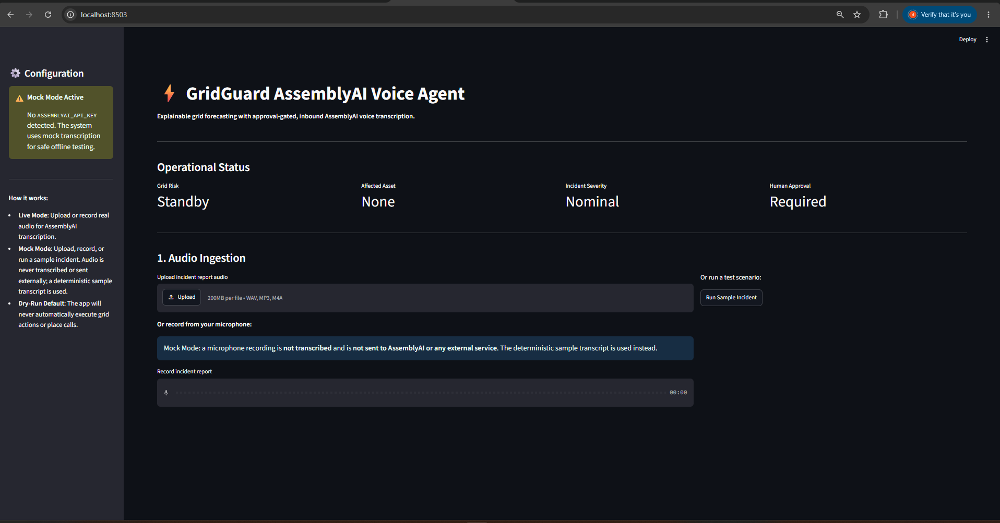
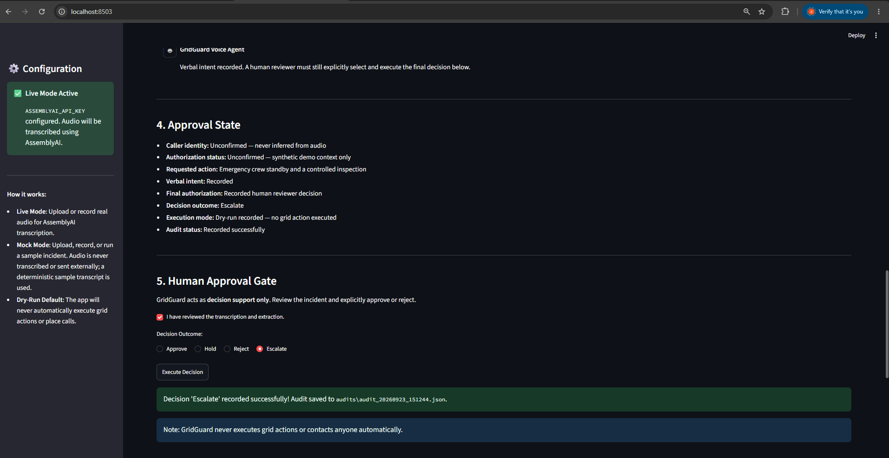
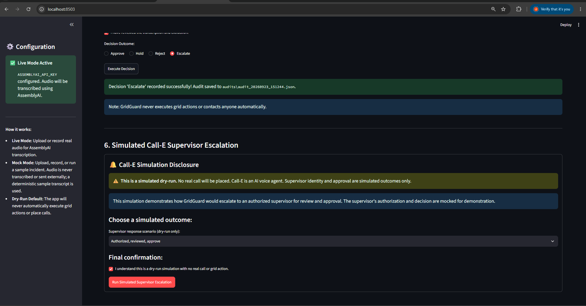
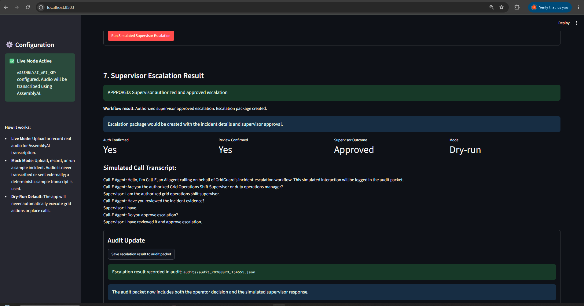
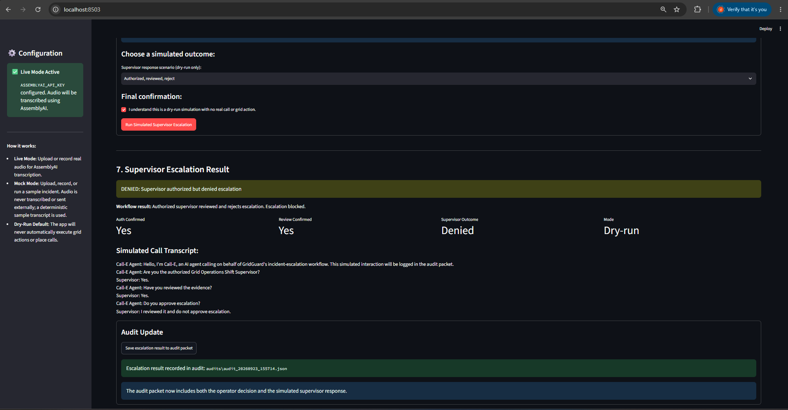

# GridGuard AssemblyAI Voice Agent

Approval-gated, inbound AssemblyAI voice transcription with local dry-run supervisor escalation simulation. Optional browser-local spoken output reads extracted incident briefings and recorded decisions aloud.

Call-E supervisor escalation is a local dry-run simulation. Optional Live Mode sends audio to AssemblyAI only for transcription; no real telephone call, external Call-E request, or grid action occurs. Browser-local spoken output uses the browser's built-in Web Speech API—not AssemblyAI, not an external service, and not voice input.

## Features
- **Upload Incident Audio**: Accepts `.wav`, `.mp3`, and `.m4a` files.
- **AssemblyAI Transcription**: Uses the official AssemblyAI Python SDK to transcribe audio incidents.
- **Mock Mode**: Fully functional offline mock mode when `ASSEMBLYAI_API_KEY` is not provided.
- **Entity Extraction**: Extracts incident location, severity, affected asset, and requested action.
- **Optional Browser-Local Spoken Output**: Reads extracted incident briefings and recorded decisions aloud using the browser's Web Speech API. Speech plays only when the user clicks its control; no autoplay, no external service, no voice input.
- **Voice Conversation Workflow**: Demonstrates a credible operational timeline where AssemblyAI provides the initial transcription, a deterministic demo authorization service verifies the caller's role (note: this is a mock directory lookup, not biometric or voice authentication), and an explicit on-screen human approval gate must be cleared before any action is recorded.
- **Human-in-the-loop Governance**: Strict approval gate requiring human consent before decisions are executed.
- **Audit Logging**: JSON-based audit packet logging.

## Windows Setup Instructions

### 1. Requirements
Ensure you have Python 3.8+ installed.

### 2. Virtual Environment Setup
It is recommended to use a virtual environment.
```powershell
# Create virtual environment
python -m venv venv

# Activate virtual environment
.\venv\Scripts\activate
```

### 3. Install Dependencies
```powershell
pip install -r requirements.txt
```

### 4. Configuration
Create a `.env` file based on `.env.example`:
```powershell
copy .env.example .env
```
If you want to test live transcription, add your AssemblyAI API key to `.env`:
```
ASSEMBLYAI_API_KEY=your_actual_key_here
```
If you leave it blank, the app runs in **Mock Mode**, allowing you to test the workflow safely.

### 5. Running Tests
To verify the extraction logic and audit gates:
```powershell
pytest tests/
```

### 6. Run the Application
Launch the Streamlit interface:
```powershell
streamlit run app.py
```
The application will open in your default browser at `http://localhost:8501`.

## Demo Walkthrough

GridGuard supports both:
* **Live Mode**: AssemblyAI transcribes uploaded or recorded audio (optional; requires `ASSEMBLYAI_API_KEY`).
* **Mock Mode**: deterministic offline fallback for safe testing when the API key is not provided.
* **Dry-run by default**: all proposed actions require explicit human approval and are audit logged; no real grid action, telephone call, or external escalation occurs.

1. **Live Mode microphone recording:** Audio is sent to AssemblyAI for transcription only after the user selects **Transcribe Recording**. The resulting incident record identifies the input channel as `microphone`.


2. **Mock Mode local transcript:** Mock Mode retains microphone input capability but does not transcribe or send the recording to AssemblyAI or any external service. It uses the deterministic sample transcript instead.


2.5. **Optional spoken operator briefing:** After incident extraction, an optional `🔊 Speak operator briefing` control reads the extracted severity, location, affected asset, and requested action aloud using the browser's Web Speech API. Speech plays only when the user clicks the control. This is browser-local; no external service or API is used.

3. **Operator selects Escalate:** The operator explicitly reviews the transcription, selects **Escalate**, and records the first human decision in the audit packet. No contact or grid action occurs automatically.


3.5. **Optional spoken decision confirmation:** After the operator decision is recorded, an optional `🔊 Speak decision confirmation` control confirms the recorded decision aloud (e.g., "Decision recorded: Escalate. This workflow remains a simulated dry run..."). Speech plays only when the user clicks the control. This is browser-local; no external service or API is used.

4. **Call-E dry-run confirmation:** Local Call-E dry-run simulation. Call-E identifies itself as an AI agent; the operator selects a simulated supervisor outcome. Before final confirmation, an optional `🔊 Preview selected scenario` control reads the currently selected scenario aloud (e.g., "Selected simulated scenario: authorized supervisor, evidence reviewed, escalation approved..."). This preview does not run the simulation or place any call. No real call, network call, or grid action occurs.


5. **Approved supervisor outcome:** Approved simulated supervisor outcome. The supervisor authorization and approval are recorded, and the audit packet includes both the operator decision and simulated supervisor result with `dry_run: true`.


6. **Denied supervisor outcome:** Denied simulated supervisor outcome. The simulated supervisor is authorized but denies escalation; the escalation is blocked and the complete result is recorded in the audit packet.


6.5. **Optional spoken audited outcome:** After the simulated supervisor result is saved to the audit packet, an optional `🔊 Speak audited outcome` control reads the actual authorization status, review status, supervisor outcome, workflow result, and dry-run confirmation aloud (e.g., "Dry-run escalation complete. Supervisor authorization and review were confirmed. The supervisor denied escalation..."). Speech plays only when the user clicks the control. This is browser-local; no external service or API is used.

## End-to-End Workflow

1. **Audio Ingestion** (Section 1)
   - Choose one input channel:
     - **Microphone**: record directly via `st.audio_input()`
     - **Upload**: select a `.wav`, `.mp3`, or `.m4a` file
     - **Sample**: run a deterministic test incident
   - Click "Transcribe Audio", "Transcribe Recording", or "Run Sample Incident"

2. **Transcription & Extraction** (Section 2)
   - **Live Mode** (if `ASSEMBLYAI_API_KEY` is set): audio is sent to AssemblyAI for live transcription
   - **Mock Mode** (if key is blank): audio is not sent externally; the app uses a deterministic canned transcript
   - Extracted incident details: location, severity, affected asset, requested action, incident ID
   - Input channel is recorded in the audit: microphone, upload, or sample
   - **Optional Operator Briefing**: Click `🔊 Speak operator briefing` to hear the extracted severity, location, affected asset, and requested action read aloud (browser Web Speech API only; no external service)

2.5. **Optional Browser-Local Spoken Briefing** (After Extraction)
   - **Control**: `🔊 Speak operator briefing`
   - **Reads**: Actual extracted severity, location, affected asset, requested action
   - **Technology**: Browser Web Speech API only; no external service, no API key, no network call
   - **When it plays**: Only when the user clicks the control (no autoplay)
   - **Note**: Spoken output is informational only; on-screen controls remain the sole approval mechanism

3. **Conversation Review Panel** (Section 3)
   - Displays a synthetic conversation timeline showing operator and agent exchange
   - No biometric, voice, or directory authentication is claimed
   - Demonstrates what a supervisor would hear (mock only)

4. **Operator Approval Gate** (Section 5)
   - **Checkbox**: "I have reviewed the transcription and extraction"
   - **Radio selection**: Approve, Hold, Reject, or **Escalate**
   - **Button**: "Execute Decision"
   - Any decision is recorded in the audit packet with timestamp
   - **Optional Decision Confirmation**: Click `🔊 Speak decision confirmation` to hear the recorded decision confirmed aloud (browser Web Speech API only; no external service)

4.5. **Optional Browser-Local Spoken Decision Confirmation** (After Decision Recorded)
   - **Control**: `🔊 Speak decision confirmation`
   - **Reads**: "Decision recorded: [actual decision]. This workflow remains a simulated dry run. No real grid action, telephone call, or external escalation has occurred."
   - **Technology**: Browser Web Speech API only; no external service, no API key, no network call
   - **When it plays**: Only when the user clicks the control (no autoplay)
   - **Note**: Spoken output confirms what was recorded; on-screen controls remain the sole approval mechanism

5. **Decision Outcomes**
   - **Approve**: Operator approves the incident response; audit is saved; workflow ends
   - **Hold**: Operator places decision on hold; audit is saved; workflow ends
   - **Reject**: Operator rejects the incident; audit is saved; workflow ends
   - **Escalate**: Operator requests supervisor escalation; Section 6 appears with dry-run call simulation (see below)

6. **Call-E Dry-Run Supervisor Escalation** (Section 6, visible only after Escalate)
   - **Disclosure Banner**:
     - "Call-E is an AI agent"
     - "This is a simulated dry-run. No real call will be placed."
     - "Supervisor identity and approval are simulated outcomes only"
   - **Scenario Selector**: Choose a simulated supervisor outcome
     - Authorized, reviewed, approve
     - Authorized, reviewed, reject
     - Not authorized / wrong person
     - Authorized, not reviewed
     - Call-E execution failure (simulated provider error)
   - **Optional Scenario Preview**: Click `🔊 Preview selected scenario` to hear the currently selected scenario read aloud before running the simulation (e.g., "Selected simulated scenario: authorized supervisor, evidence reviewed, escalation approved..."). This preview does not run the simulation or place any call (browser Web Speech API only; no external service)
   - **Second Confirmation Checkbox**: "I understand this is a dry-run simulation with no real call or grid action"
   - **Button**: "Run Simulated Supervisor Escalation"
   - The simulated transcript includes: Call-E self-identifying as an AI agent, no external call or network activity

6.5. **Optional Selected-Scenario Preview** (Before Running Simulation)
   - **Control**: `🔊 Preview selected scenario`
   - **Reads**: The currently selected scenario (e.g., "Selected simulated scenario: authorized supervisor, evidence reviewed, escalation approved...")
   - **Technology**: Browser Web Speech API only; no external service, no API key, no network call
   - **When it plays**: Only when the user clicks the control (no autoplay)
   - **What it does NOT do**: Does not run the simulation, place any call, or execute any action
   - **Note**: Preview is informational only; the "Run Simulated Supervisor Escalation" button remains the only trigger for simulation

7. **Supervisor Response & Result** (Section 7, after simulation runs)
   - **Status**: Shows canonical outcome (Approved, Denied, Unavailable, or Failed)
   - **Metrics**: Auth Confirmed, Review Confirmed, Supervisor Outcome, Mode
   - **Simulated Transcript**: Full mock conversation
   - **Audit Button**: "Save escalation result to audit packet"

7.5. **Optional Audited Outcome Summary** (After Saving to Audit Packet)
   - **Control**: `🔊 Speak audited outcome`
   - **Reads**: The actual authorization status, review status, supervisor outcome, workflow result, and audit-save confirmation (e.g., "Dry-run escalation complete. Supervisor authorization and review were confirmed. The supervisor denied escalation...")
   - **Technology**: Browser Web Speech API only; no external service, no API key, no network call
   - **When it plays**: Only when the user clicks the control, and only after the audit packet has been saved (no autoplay)
   - **Note**: Audited outcome summary is informational only; on-screen controls and audit records remain authoritative

8. **Audit Packet** (Final)
   - Saved as JSON in `audits/` directory
   - Contains:
     - Timestamp (UTC ISO format with Z suffix)
     - Original transcript
     - Incident details (location, severity, asset, action, ID)
     - Input channel (microphone, upload, or sample)
     - Source (mock or assemblyai_live)
     - Operator decision and outcome state
     - Supervisor escalation result (if applicable): auth_confirmed, review_confirmed, approval_decision, supervisor_outcome, workflow_result, simulated transcript
     - `dry_run: true` (always; no real action is ever executed)

## Decision and Supervisor Outcomes

| Operator Decision | Audit Status | Call-E Simulation | Supervisor Outcome | Next Step |
|---|---|---|---|---|
| **Approve** | Recorded | No | N/A | Workflow ends |
| **Hold** | Recorded | No | N/A | Workflow ends |
| **Reject** | Recorded | No | N/A | Workflow ends |
| **Escalate** | Recorded | Yes (dry-run only) | Approved, Denied, Unavailable, or Failed | Save to audit |

**Supervisor Outcomes** (when Escalate is chosen):
- **Approved**: Authorized supervisor reviewed and approved the escalation
- **Denied**: Authorized supervisor reviewed and denied the escalation
- **Unavailable**: Supervisor not authorized or not available for review
- **Failed**: Simulated Call-E execution failure (no contact established)

## Safety Boundaries

**What is NOT in this system:**

- ❌ No real telephone call is placed
- ❌ No Call-E SDK integration or API key is used
- ❌ No phone number (E.164 format) is stored or dialed
- ❌ No biometric voice authentication or verification
- ❌ No real supervisor identity verification (simulated only)
- ❌ No emergency dispatch or grid action execution
- ❌ No WebSocket streaming or real-time call signaling
- ❌ No automatic action without explicit human approval
- ❌ **Browser-local spoken output is NOT AssemblyAI text-to-speech, not the AssemblyAI Voice Agent API, and not a real-time voice-agent session**
- ❌ **Spoken output is NOT voice input and cannot provide approval, authorization, or consent**
- ❌ **Spoken output uses only the browser's Web Speech API; no external service or paid API is involved**

**What is guaranteed:**

- ✓ **Dry-run by default**: `dry_run: true` in every audit packet
- ✓ **Two approval gates**: Operator must approve before decision is recorded; second confirmation required before supervisor simulation runs
- ✓ **AI disclosure**: Simulated Call-E agent explicitly identifies itself as an AI agent in the transcript
- ✓ **Mock Mode safety**: Audio is never sent to AssemblyAI if the API key is not configured
- ✓ **Audit trail**: Complete transcript of all decisions and simulated outcomes
- ✓ **Local simulation**: All supervisor escalation is computed locally; no external network calls for Call-E
- ✓ **Browser speech**: Optional spoken output plays only when the user clicks its control (no autoplay), uses the browser's built-in Web Speech API (no external service), and cannot approve, authorize, or trigger any action; on-screen controls remain the sole authoritative approval mechanism

## Architecture

```mermaid
flowchart TD
    Start([User starts app]) --> Input{Input channel}
    Input -->|Microphone| Mic["Record audio<br/>via st.audio_input"]
    Input -->|Upload| Upload["Select .wav, .mp3, .m4a<br/>file"]
    Input -->|Sample| Sample["Run deterministic<br/>test incident"]

    Mic --> CheckKey{ASSEMBLYAI_API_KEY<br/>configured?}
    Upload --> CheckKey
    Sample --> Mock

    CheckKey -->|Yes| Live["Live Mode:<br/>Send audio to AssemblyAI<br/>Get transcript"]
    CheckKey -->|No| Mock["Mock Mode:<br/>Use deterministic<br/>canned transcript<br/>(no external call)"]

    Live --> Extract["Extract incident details:<br/>location, severity, asset,<br/>requested action, ID"]
    Mock --> Extract

    Extract --> Display["Display transcript &<br/>extracted details"]

    Display --> Briefing{"Optional:<br/>User clicks<br/>speak briefing?"}
    Briefing -->|Yes| SpokenBrief["Browser-local spoken briefing<br/>Read severity, location,<br/>affected asset, action<br/>(Web Speech API only;<br/>no external service)"]
    Briefing -->|No| Gate["Operator Approval Gate:<br/>Review & choose outcome"]
    SpokenBrief --> Gate

    Gate --> Decision{Operator<br/>Decision}
    Decision -->|Approve| Audit1["Record decision<br/>in audit packet"]
    Decision -->|Hold| Audit1
    Decision -->|Reject| Audit1
    Decision -->|Escalate| Confirm["Second Confirmation:<br/>Checkbox required:<br/>Acknowledge this is<br/>a dry-run simulation"]

    Confirm --> ScenarioSelect["Choose scenario &<br/>Optional scenario preview:<br/>click 🔊 Preview selected scenario<br/>(Web Speech API only;<br/>no external call)"]

    ScenarioSelect --> SimCall["Local Call-E Simulation:<br/>- AI agent self-identifies<br/>- Compute supervisor response<br/>(no network call)"]

    SimCall --> Result["Supervisor Result:<br/>Approved/Denied/<br/>Unavailable/Failed"]
    Result --> Audit2["Record operator decision<br/>+ supervisor result<br/>in audit packet"]

    Audit1 --> ConfirmCheck1{"Optional:<br/>User clicks<br/>speak confirmation?"}
    Audit2 --> AuditedOutcome{"Optional:<br/>User clicks<br/>speak audited outcome?"}

    ConfirmCheck1 -->|Yes| SpokenConfirm1["Browser-local spoken confirmation<br/>Confirm recorded decision<br/>Affirm dry-run status<br/>(Web Speech API only;<br/>no external service)"]
    ConfirmCheck1 -->|No| End1["Workflow ends<br/>dry_run: true"]
    SpokenConfirm1 --> End1

    AuditedOutcome -->|Yes| SpokenAudited["Browser-local spoken audited outcome<br/>Read authorization, review,<br/>supervisor outcome, workflow result<br/>(Web Speech API only;<br/>no external service)"]
    AuditedOutcome -->|No| End2["Workflow ends<br/>dry_run: true"]
    SpokenAudited --> End2

    style Live fill:#e1f5ff,color:#000000
    style Mock fill:#fff3e0,color:#000000
    style Audit1 fill:#e8f5e9,color:#000000
    style Audit2 fill:#e8f5e9,color:#000000
    style SimCall fill:#f3e5f5,color:#000000
    style SpokenBrief fill:#fce4ec,color:#000000
    style SpokenConfirm1 fill:#fce4ec,color:#000000
    style ScenarioSelect fill:#ffe0f0,color:#000000
    style SpokenAudited fill:#fce4ec,color:#000000
```



**Key design points:**
- **Input diversity**: Microphone, upload, or deterministic sample ensure offline testing is always possible
- **Mode toggle**: Live/Mock decision is automatic; respects `ASSEMBLYAI_API_KEY` presence, not a user choice
- **Human gates**: Two explicit checkboxes and one decision radio ensure intentional approval
- **Local simulation**: Supervisor escalation is computed entirely offline; no external API calls for Call-E
- **Audit completeness**: Both operator and simulated supervisor decisions are captured in one JSON packet with `dry_run: true`
- **Optional browser speech**: Three optional spoken-output points (operator briefing, scenario preview, audited outcome) use only the browser Web Speech API (no external service, no AssemblyAI TTS, no paid API); speech plays only when the user clicks its control (no autoplay); these are informational only and cannot approve, authorize, or trigger any action; on-screen controls remain the sole authoritative approval mechanism
